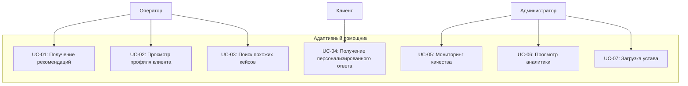

# Функциональные требования

## 1. Use Cases для оператора поддержки

### UC-01: Получение рекомендаций по ответу клиенту

| Параметр | Описание |
|----------|----------|
| **ID** | UC-01 |
| **Название** | Получение рекомендаций по ответу клиенту |
| **Акторы** | Оператор поддержки (первичный), Система (вторичный) |
| **Предусловия** | • Оператор авторизован в системе и открыл диалог с клиентом • Клиент отправил сообщение • Система имеет доступ к истории клиента и уставу организации |
| **Основной поток** | 1. Оператор открывает чат с клиентом 2. Система анализирует последнее сообщение клиента 3. Система определяет интент и извлекает ключевые сущности 4. Система ищет релевантные пункты в уставе 5. Система анализирует историю обращений клиента 6. Система формирует 2-3 варианта ответа с разной тональностью 7. Система отображает рекомендации в боковой панели интерфейса 8. Оператор просматривает рекомендации 9. Оператор выбирает подходящий вариант и одним кликом вставляет в чат 10. Оператор отправляет сообщение клиенту |
| **Постусловия** | • Рекомендация помечена как "использована" • Система фиксирует факт использования для обучения модели |
| **Альтернативные потоки** | **8a. Оператор не находит подходящую рекомендацию:** 8a1. Оператор пишет ответ самостоятельно 8a2. Система анализирует написанный ответ и предлагает улучшения 8a3. Оператор принимает или игнорирует улучшения  **4a. Система не находит релевантных пунктов в уставе:** 4a1. Система уведомляет оператора об отсутствии информации в уставе 4a2. Система предлагает общий шаблон ответа на основе интента |
| **Исключительные потоки** | **2e. Ошибка соединения с системой:** 2e1. Оператор видит уведомление о недоступности системы 2e2. Оператор работает без рекомендаций до восстановления связи |
| **Бизнес-правила** | • BR-01: Рекомендации не должны противоречить уставу организации |

---

### UC-02: Просмотр профиля клиента

| Параметр | Описание |
|----------|----------|
| **ID** | UC-02 |
| **Название** | Просмотр профиля клиента |
| **Акторы** | Оператор поддержки, Система |
| **Предусловия** | • Оператор авторизован в системе • Открыт диалог с клиентом • Система имеет доступ к CRM и истории обращений |
| **Основной поток** | 1. Оператор открывает чат с клиентом 2. Система загружает профиль клиента из CRM 3. Система анализирует историю предыдущих обращений 4. Система отображает в интерфейсе:    - ФИО клиента и статус (VIP/обычный)    - Историю обращений (даты, темы, результаты)    - Текущее эмоциональное состояние    - Предпочтительный стиль общения 5. Оператор использует эту информацию для персонализации общения |
| **Постусловия** | Система фиксирует факт просмотра профиля (для аналитики) |
| **Альтернативные потоки** | **2a. Клиент не найден в CRM:** 2a1. Система создает временный профиль на основе текущего диалога 2a2. Оператор может вручную добавить информацию о клиенте |
| **Исключительные потоки** | **2e. Ошибка подключения к CRM:** 2e1. Система уведомляет оператора о недоступности CRM 2e2. Оператор работает с ограниченной информацией |
| **Бизнес-правила** | • BR-02: Доступ к профилю клиента имеют только операторы с соответствующими правами • BR-03: История хранится не более 3 лет согласно 152-ФЗ |

---

### UC-03: Поиск в истории похожих кейсов

| Параметр | Описание |
|----------|----------|
| **ID** | UC-03 |
| **Название** | Поиск в истории похожих кейсов |
| **Акторы** | Оператор поддержки, Система |
| **Предусловия** | • Оператор работает со сложным или нестандартным обращением • Система имеет доступ к базе исторических диалогов |
| **Основной поток** | 1. Оператор нажимает кнопку "Найти похожие решения" 2. Система анализирует текущий запрос 3. Система выполняет векторный поиск в базе исторических диалогов 4. Система находит 5-10 наиболее похожих завершенных кейсов 5. Система отображает список найденных кейсов с указанием:    - Краткого описания проблемы    - Использованного решения    - Результата (CSAT, статус) 6. Оператор выбирает подходящий кейс для просмотра деталей 7. Система показывает полный диалог и использованные шаблоны |
| **Постусловия** | Система фиксирует факт использования исторического кейса |
| **Альтернативные потоки** | **4a. Похожих кейсов не найдено:** 4a1. Система уведомляет оператора об отсутствии похожих кейсов 4a2. Система предлагает создать новый шаблон на основе текущего диалога |
| **Бизнес-правила** | • BR-04: Поиск выполняется только по успешным кейсам (CSAT > 4) |

---

## 2. Use Cases для клиента

### UC-04: Получение персонализированного ответа

| Параметр | Описание |
|----------|----------|
| **ID** | UC-04 |
| **Название** | Получение персонализированного ответа |
| **Акторы** | Клиент (первичный), Система (вторичный) |
| **Предусловия** | • Клиент авторизован на сайте/в приложении • Клиент инициировал обращение в поддержку • Клиент имеет историю предыдущих обращений |
| **Основной поток** | 1. Клиент открывает чат поддержки 2. Клиент задает вопрос или описывает проблему 3. Система распознает клиента и загружает его историю 4. Система передает контекст оператору 5. Оператор (с помощью системы) формирует ответ с учетом:    - Истории клиента (без повторов)    - Предпочтительного стиля общения    - Текущего эмоционального состояния 6. Клиент получает ответ, который учитывает предыдущие взаимодействия 7. Клиент не тратит время на повторное объяснение проблемы |
| **Постусловия** | Клиент оценивает качество ответа (CSAT) |
| **Альтернативные потоки** | **3a. Клиент обращается впервые:** 3a1. Система создает новый профиль клиента 3a2. Оператор использует стандартные шаблоны с базовой персонализацией |
| **Бизнес-правила** | • BR-05: Клиент имеет право на получение информации о том, какие данные о нем хранятся |

---

## 3. Use Cases для администратора

### UC-05: Мониторинг качества в реальном времени

| Параметр | Описание |
|----------|----------|
| **ID** | UC-05 |
| **Название** | Мониторинг качества в реальном времени |
| **Акторы** | Администратор, Система |
| **Предусловия** | • Администратор авторизован в системе • В системе активно хотя бы 5 диалогов |
| **Основной поток** | 1. Администратор открывает дашборд мониторинга 2. Система отображает в реальном времени:    - Количество активных диалогов    - Среднее время ожидания    - Текущий CSAT по диалогам    - Список рискованных диалогов (негатив, затянувшиеся) 3. Система подсвечивает диалоги, требующие внимания 4. Администратор выбирает рискованный диалог для просмотра 5. Система показывает полный диалог и рекомендации системы 6. При необходимости администратор подключается к диалогу |
| **Постусловия** | Действия администратора логируются для последующего анализа |
| **Альтернативные потоки** | **3a. Критический диалог (угроза оттока):** 3a1. Система отправляет push-уведомление администратору 3a2. Администратор немедленно открывает диалог |
| **Бизнес-правила** | • BR-06: Диалог считается рискованным при негативной тональности > 0.7 или длительности > 15 минут |

---

### UC-06: Просмотр аналитики эффективности

| Параметр | Описание |
|----------|----------|
| **ID** | UC-06 |
| **Название** | Просмотр аналитики эффективности |
| **Акторы** | Администратор, Система |
| **Предусловия** | Система накопила данные минимум за 7 дней |
| **Основной поток** | 1. Администратор открывает раздел аналитики 2. Система отображает ключевые метрики:    - Средний CSAT по операторам и в целом    - FCR (решение с первого раза)    - Acceptance Rate рекомендаций    - Топ проблем и категорий обращений    - Динамику нагрузки по часам/дням 3. Администратор может фильтровать данные по датам, операторам, категориям 4. Администратор экспортирует отчет для презентации руководству |
| **Постусловия** | Отчет сохраняется в истории для последующего сравнения |
| **Бизнес-правила** | • BR-07: Данные обезличены для операторов с целью защиты персональных данных |

---

### UC-07: Загрузка и обновление устава

| Параметр | Описание |
|----------|----------|
| **ID** | UC-07 |
| **Название** | Загрузка и обновление устава |
| **Акторы** | Администратор, Система |
| **Предусловия** | • Администратор авторизован с правами на редактирование устава • Получена новая версия документа устава |
| **Основной поток** | 1. Администратор открывает раздел управления уставом 2. Администратор загружает документ (PDF, DOCX, TXT) 3. Система проверяет формат и целостность файла 4. Система выполняет парсинг документа, выделяя структуру (разделы, пункты) 5. Система индексирует содержимое для семантического поиска 6. Система сохраняет предыдущую версию в истории 7. Система уведомляет администратора об успешной загрузке 8. Новая версия становится активной для всех операторов |
| **Постусловия** | Все операторы получают уведомление об обновлении устава |
| **Альтернативные потоки** | **4a. Ошибка парсинга документа:** 4a1. Система сообщает об ошибке с указанием проблемных мест 4a2. Администратор может вручную отредактировать документ в интерфейсе 4a3. Администратор повторяет попытку загрузки |
| **Бизнес-правила** | • BR-08: Каждое обновление устава должно быть подтверждено юридическим отделом |

---

## 4. Матрица трассировки требований

| Use Case | Связанные бизнес-правила | Версия |
|----------|-------------------------|--------|
| **UC-01** | BR-01 | 1.0 |
| **UC-02** | BR-02, BR-03 | 1.0 |
| **UC-03** | BR-04 | 1.5 |
| **UC-04** | BR-05 | 1.0 |
| **UC-05** | BR-06 | 1.0 |
| **UC-06** | BR-07 | 1.5 |
| **UC-07** | BR-08 | 1.0 |

---

## Сводная диаграмма Use Case

